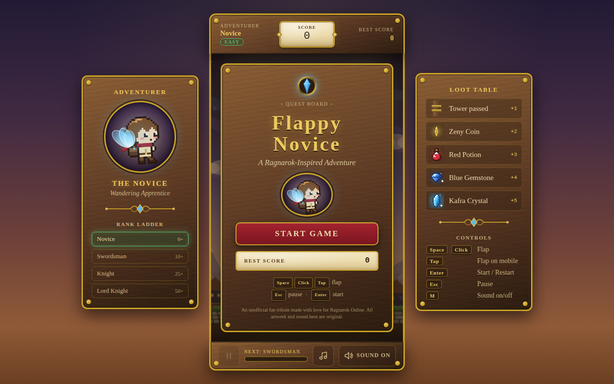
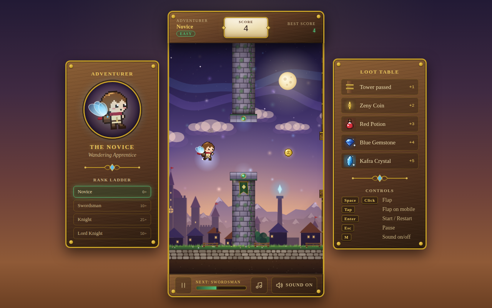
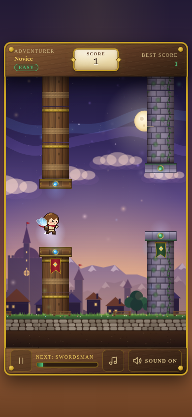
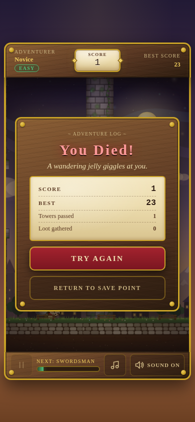

# 🪽 Flappy Novice

**Flappy Novice** is a one-button arcade flight through a Ragnarok-inspired fantasy world. A young Novice with a pair of mana wings hops between carved-wood watchtowers and mossy castle ruins, picking up Zeny, potions and Kafra crystals on the way.

It's a companion game to [Ragna-Memories](https://github.com/ewertonce/ragna-memories). It uses the same parchment, carved wood, antique gold and crystal-glow design language, so both games look like they come from the same world.

| Title screen | Gameplay | Mobile | Defeat |
|---|---|---|---|
|  |  |  |  |

---

## 🚀 Run it

**No tooling:** double-click `index.html`. The game uses classic `<script>` tags with no modules and no bundler, so it runs straight from disk.

**With a local server** (recommended for development and required for tests):

```bash
npm install
npm run dev        # → http://127.0.0.1:5173
```

`npm run dev` uses a tiny zero-dependency Node server (`scripts/serve.mjs`). The only npm dependency is `@playwright/test`, and it's only used for testing.

---

## 🎮 How to play

| Input | Action |
|---|---|
| `Space` / `↑` / `W` / **Click** / **Tap** | Flap (Space also starts from the title screen) |
| `Enter` | Start · Restart · Resume |
| `Esc` / `P` | Pause / resume |
| `M` | Sound on/off |

The page never scrolls or zooms while you play. The play field uses `touch-action: none` and blocks touch gestures, and the game pauses automatically when you switch tabs.

### Scoring

| Event | Points |
|---|---|
| Tower pair passed | **+1** |
| Zeny Coin | **+2** |
| Red Potion | **+3** |
| Blue Gemstone | **+4** |
| Kafra Crystal | **+5** |

The best score is saved in `localStorage` under the key `flappy-novice-best`.

### Ranks & difficulty

Difficulty rises in four gentle steps. Each step adds a little speed, narrows the gap slightly and allows bigger height changes between gaps. The rank names follow the Ragna-Memories difficulty ladder.

| Score | Difficulty | Rank | Speed bonus | Gap | Extra |
|---|---|---|---|---|---|
| 0–9 | Easy | Novice | +0 | 155 | — |
| 10–24 | Medium | Swordsman | +0.5 | 149 | — |
| 25–49 | Hard | Knight | +1.1 | 142 | — |
| 50+ | Extreme | Lord Knight | +1.8 (capped at `maxObstacleSpeed`) | 135 | towers sway ±16 px |

Speed eases toward each new target instead of jumping, so a rank-up never makes the game suddenly unfair.

---

## 🗂️ Project structure

```text
/
├── index.html              # markup, overlays, data-testids
├── style.css               # shared Ragna-Memories design tokens + UI
├── config.js               # GAME_CONFIG, difficulty tiers, loot, states, transitions
├── game.js                 # Game class: pure simulation (no DOM, no canvas)
├── main.js                 # bootstrap, fixed-timestep loop, window.FlappyNovice API
├── entities/
│   ├── player.js           # Novice physics + rotation (-15° up … +20° down)
│   ├── obstacle.js         # tower pair, hit-boxes, "passed" flag
│   ├── collectible.js      # loot
│   └── particle.js         # visual-only particle system
├── systems/
│   ├── state-machine.js    # centralised FSM with a transition table
│   ├── collision.js        # pure circle/rect helpers
│   ├── input.js            # keyboard + pointer + touch
│   ├── audio.js            # Web Audio SFX + music sequencer
│   ├── renderer.js         # canvas drawing, parallax, particles, screen shake
│   ├── random.js           # seedable PRNG (mulberry32)
│   └── storage.js          # guarded localStorage
├── ui/
│   ├── hud.js              # score plaque, best, rank, progress, toggles
│   ├── menu.js             # title screen + side panels
│   ├── pause.js            # "Resting at the Inn"
│   └── game-over.js        # "You Died!" adventure log
├── assets/
│   ├── characters/novice.js      # original pixel-art Novice (palette + pixel rows)
│   ├── items/items.js            # original pixel-art loot
│   ├── environment/scenery.js    # procedural parallax landscape
│   ├── environment/obstacles.js  # procedural tower textures
│   ├── audio/music.js            # original 16-bar tune as note data
│   └── ui/*.svg                  # crystal crest, gold divider
├── tests/                  # Playwright specs + helpers
├── scripts/serve.mjs       # zero-dependency dev server
└── playwright.config.js
```

### Architecture in one paragraph

`Game` (in `game.js`) owns all gameplay state and advances one **fixed 60 Hz tick** per `update()`. Physics are the same at any monitor refresh rate, and a given seed plus the same inputs always produce the same run. The game never touches the DOM. It emits events (`statechange`, `flap`, `score`, `collect`, `hit`, `tierchange`, `reset`), and the renderer, HUD, overlays and audio subscribe to them. `main.js` runs `requestAnimationFrame` with an accumulator and interpolates positions between ticks, so motion also looks smooth on 120 Hz screens.

### State machine

```text
            start                    pause
  MENU ───────────────▶ PLAYING ◀──────────▶ PAUSED
   ▲                    │  ▲  resume           │
   │ menu               │  │ restart           │ menu / restart
   │                    ▼  │                   │
   └────────────────  GAME_OVER ◀──────────────┘
```

The `STATE_TRANSITIONS` table in `config.js` lists every allowed transition, and anything else is rejected. There are no `isPlaying` / `isDead` / `hasStarted` flags.

---

## ⚙️ Configuration

Every tunable value lives in `GAME_CONFIG` (`config.js`). The most useful ones:

```js
const GAME_CONFIG = {
    gravity: 0.42,          // px / tick²
    jumpStrength: -7.2,     // px / tick
    obstacleSpeed: 3,       // starting scroll speed
    maxObstacleSpeed: 5,    // difficulty cap
    obstacleGap: 155,       // vertical opening
    obstacleSpacing: 280,   // distance between tower pairs
    playerX: 120, playerStartY: 300, playerRadius: 14,
    collectibleChance: 0.6,
    autoSpawn: true,        // false → place obstacles manually
    difficultyScaling: true,
    seed: null,             // number → deterministic runs
    invincible: false,      // QA soak tests
};
```

You can also change the config at runtime with `FlappyNovice.setConfig({...})`.

---

## 🧪 QA & automation

### URL parameters

| Param | Effect |
|---|---|
| `?seed=1234` | Deterministic tower and loot layout |
| `?manual=1` | Freezes the real-time simulation. Advance it with `FlappyNovice.step(n)` |
| `?hitbox=1` | Draws the player's collision circle |

### `window.FlappyNovice`

```js
// lifecycle
startGame() pauseGame() resumeGame() restartGame() goToMenu() resetGame() flap()
// world
spawnObstacle({ x, gapY, gap, type }) spawnCollectible({ type, x, y }) clearObstacles()
increaseScore(n) checkCollision() setPlayer({ x, y, vy })
// queries
getGameState() getScore() getHighScore() getPlayer() getObstacles() getCollectibles()
getStats() getSnapshot() getTier() getConfig() getSeed()
// determinism
setConfig(partial) setSeed(n) step(n) setManualMode(bool) setDebugHitboxes(bool)
// audio (records what was played, so it can be tested without speakers)
audio.isEnabled() audio.setEnabled(b) audio.getLastSound() audio.getHistory() audio.clearHistory()
// events
on('statechange' | 'score' | 'collect' | 'hit' | 'tierchange' | 'flap' | 'reset', fn)
```

### Observable DOM

| Selector | Content |
|---|---|
| `[data-testid="game-state"]` | `menu` · `playing` · `paused` · `game_over` |
| `[data-testid="score"]` | current score |
| `[data-testid="high-score"]` | best score (live) |
| `[data-testid="difficulty"]`, `[data-testid="rank"]` | tier and rank |
| `[data-testid="sound-state"]` | `Sound ON` / `Sound OFF` |
| `[data-testid="final-score"]`, `final-high-score`, `new-record`, `gameover-message` | defeat window |
| `button[aria-label="Start game" \| "Restart game" \| "Pause game" \| "Resume game" \| "Mute sound" \| "Unmute sound" \| "Mute music" \| "Return to main menu"]` | controls |
| `body[data-state]`, `body[data-ready="true"]` | state for CSS / ready flag for tests |

### Running the tests

```bash
npm install
npx playwright install chromium   # first time only
npm test                          # all specs × desktop / tablet / mobile
npm run test:ui                   # interactive runner
```

The suite has 54 specs, run on three form factors (desktop 1280×800, tablet 820×1180 touch, mobile 390×844 touch), for **162 tests**. It covers start, controls (Space, click, tap, Esc), scoring (single-count per tower, loot, tiers, speed cap, seed determinism), collisions (towers, ground, ceiling, freeze after death, invincible mode), restart (score, player and obstacle reset), high score (localStorage, refresh, no overwrite, corrupted value), audio (toggle, persistence, muted SFX, music), state machine (invalid transitions, full path, auto-pause) and responsive layout (2:3 ratio, no scrolling, 44 px touch targets, readable text, HiDPI canvas).

Most tests open the game with `?manual=1`, turn gravity off and place towers by hand, then advance exact tick counts. That makes them fast and never flaky, and none of them need to inspect canvas pixels.

A GitHub Actions workflow (`.github/workflows/test.yml`) runs the suite on every push and pull request to `main`.

---

## 🎨 Design lineage: what came from Ragna-Memories

These visual principles were **carried over** from Ragna-Memories (`style.css`, `index.html`, `game.js`):

- **Colour tokens, copied 1:1:** `--parchment #ecdcae`, `--wood-dark/mid/light`, `--gold #c9a227`, `--gold-bright #ecca5e`, `--burgundy`, `--emerald #2f5233`, `--ink`. New tokens (`--crystal`, `--emerald-bright`, `--mystic`) extend the same palette.
- **Page backdrop:** the same dusk-purple-to-amber gradient with a soft gold radial glow at the top.
- **Typography:** *Cinzel Decorative* for rune titles, *Cinzel* small caps for labels, *EB Garamond* for body text, *Press Start 2P* for numbers.
- **`.wood-panel` + gold rivets:** carved-wood gradient panels with a 3 px antique-gold border, inset shadow and four brass rivets. Used for every window, the HUD and the side panels.
- **Quest buttons:** burgundy gradient buttons with gold borders that turn gold with ink text on hover.
- **Gold-ring gem socket:** the Kafra-crystal card back became the gem socket on every tower cap (blue on wooden towers, emerald on stone ones) and the crest above the title.
- **Emerald success accents:** used for the record ribbon, the active rank and the progress bar, like Ragna-Memories' emerald match glow.
- **Pop-up animation:** rank-up banners reuse the combo-popup pop-and-fade, and the score plaque reuses the `score-pop` pulse.
- **Hero portrait card:** the floating, glowing portrait frame (Darian in Ragna-Memories) now holds the Novice.
- **Sound style:** synthesised Web Audio blips. The defeat motif (G-F-E♭-C) and the rising victory arpeggio mirror Ragna-Memories' sounds, so the two games sound related.
- **Rank ladder:** Novice → Swordsman → Knight → Lord Knight, taken from its difficulty selector.

### What is original

**Every asset in this repository was made for Flappy Novice.** There are no sprites, images, music or sound files from Ragnarok Online, Flappy Bird or any other game.

- **The Novice:** an original chibi pixel-art character drawn pixel by pixel in `assets/characters/novice.js`. The mana wings and fluttering scarf are drawn procedurally so they can animate.
- **Loot:** original pixel art for the Zeny coin, Red Potion, Blue Gemstone and Kafra-style crystal (`assets/items/items.js`).
- **Towers:** procedurally painted carved-wood watchtowers and mossy stone ruins with animated banners (`assets/environment/obstacles.js`).
- **Landscape:** a procedural sky, aurora, moon, mountains, clouds, a hill-top capital with a crystal tower, a village and a cobblestone road (`assets/environment/scenery.js`).
- **UI ornaments:** hand-written SVG crystal crest and gold divider (`assets/ui/`).
- **Audio:** all sound effects are synthesised at runtime. The background loop, *Road to the Capital*, is an original 16-bar tune in D minor stored as note data (`assets/audio/music.js`).

The Ragna-Memories monster images (`imgs/`) are **not** used here.

---

## ⚠️ Disclaimer

This game was made out of nostalgia and love for Ragnarok Online. *Ragnarok Online*, its names and trademarks belong to Gravity Co., Ltd. This is an unofficial fan tribute and is not affiliated with or endorsed by Gravity. The one-button "flappy" mechanic is a common arcade genre, and no Flappy Bird assets are used.
